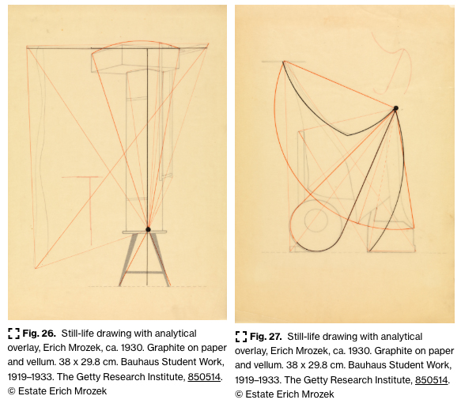

# [Bauhaus](https://www.getty.edu/research/exhibitions_events/exhibitions/bauhaus/new_artist/ "Bauhaus")
- Early Bauhaus(1919-1925) - Weimar, Germany Walter Gropius
- Middle Bauhaus(1925-1932) - Dessau, Germany Hannes Meyer
- Late Bauhaus(1932-1933) - Berlin, Germany Ludwig Mies van der Rohe
## [Bauhaus exercises](https://drive.google.com/file/d/1n2NGMMVqh6EuI2vqekG4Cc391IaflpFt/view?usp=drive_link)
## [Form](https://www.getty.edu/research/exhibitions_events/exhibitions/bauhaus/new_artist/form_color/form/ "Form")

<details>
  <summary>Analytical Drawing</summary>

Analytical drawing exercises gave students the opportunity to observe the interaction of points, lines, and planes in everyday objects. Far from simply training artists to faithfully copy still-life arrangements, Kandinsky insisted that the study of nature revealed the forces of abstraction: “Natural laws of composition do not reveal to the artist the possibility of superficial imitation (which he frequently sees as the main purpose of the laws of nature) but, rather, the possibility of contrasting these laws with those of art.”9

Kandinsky’s analytical drawing practice found a parallel in Itten’s analytical study of old master paintings in the Preliminary Course. In this exercise, students drew grids over reproductions of canonical works of art in order to allow the most detailed analysis of form and color in the smallest gradient. The ultimate goal for both Itten and Kandinsky was the synthesis of external (natural) and internal (artistic) laws in the art of pictorial composition.



Two drawings created in Dessau by student Erich Mrozek reveal the complexity of Kandinsky’s assignment. First, students sketched a still-life arrangement in pencil—for example, a stool balancing a stack of boxes (fig. 26) or a curtain draped over various objects (fig. 27). The pencil sketch was then traced in ink and covered with a sheet of transparent paper. Starting at one point and spreading outward across the surface of the image, students mapped the linear tensions that structured the sketch below. Mrozek’s analysis reveals two utterly distinct abstractions generated from the study of a concrete scene.
</details>

<details>
  <summary>Back to the Bauhaus</summary>

The idea of searching out a shared framework in which to invent and organize visual content dates back to the origins of modern graphic design -- institutions such as the Bauhaus in Germany explored design as a universal, perceptually based “language of vision,”.
### Whereas the Bauhaus promoted rational solutions through planning and standardization
Visual thinkers often seek to spin out intricate results from simple rules or concepts rather than reduce an image or idea to its simplest parts.
- The Bauhaus and other schools ```analyzed form in terms of basic geometric elements```. 
- Design, they argued, is never reducible to its function or to a technical description.
- Each of these revolutionary  Bauhaus educators```articulated structural approaches``` to design from distinct and original perspectives.
</details>
