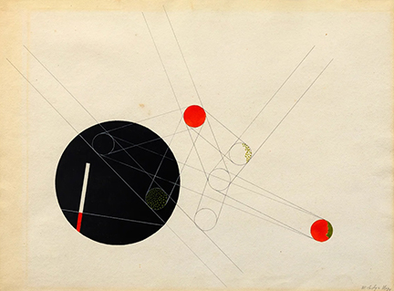

# Constructivism
Constructivism is a design and art movement that originated in Russia in the early 20th century. It is known for its geometric abstraction, functional aesthetics, and use of industrial materials. In design art, Constructivism focuses on structure, utility, and bold visual communication. Here's a breakdown of its design methods and key principles:

  
Key Design Methods in Constructivism

### Geometric Composition
- Uses straight lines, circles, rectangles, and dynamic diagonal elements.
- Avoids decorative flourishes—focuses on order and clarity.

### Asymmetry and Visual Tension
- Rejects classical balance; instead, it uses asymmetrical layouts to create dynamic energy.
- Diagonals, overlays, and non-centered elements are common.

### Limited Color Palette
- Often uses primary colors (red, blue, yellow) with black, white, and gray.
- Colors are used for structural or symbolic emphasis, not decoration.

### Typography as Structure
- Type is treated as a visual element, not just text.
- Uses bold sans-serif fonts, vertical/horizontal text, and diagonal text placement.
- Words become part of the visual grid, often interacting with shapes.

### Photomontage and Mixed Media
- Combines photographs, cutouts, and graphic elements.
- Emphasizes social messages, industrial progress, and propaganda-like clarity.

### Function Over Form
- Design must serve a social or practical purpose—not just aesthetics.
- Posters, books, exhibitions, and architecture were intended to educate or mobilize.

### Grid and Modularity
- Underlying grid systems organize content.
- Repeated modular elements reflect mechanical, mass-production ideals.

  
Example Influences

- ### El Lissitzky: 
Pioneer in merging art with graphic design through “Proun” compositions.

- ### Alexander Rodchenko: 
Known for typographic experiments and photomontage.

- ### László Moholy-Nagy (Bauhaus): 
Influenced by Constructivist ideas, brought them into modern design.

  
Constructivism in UI/UX Design

  - #### Clarity and Functionality First
    - Constructivism prioritizes utility over decoration—this aligns well with usability heuristics in UI/UX (e.g., simplicity, visibility of system status, user control).
    - Its clear visual hierarchy helps users scan and act quickly.

  - #### Grid Systems and Layout
    The rigid, modular structure of Constructivist design maps beautifully to responsive grid systems in modern web/app design.
    Enables predictable yet flexible layouts.

  - #### Bold Typography
    - Typography as a graphic and functional tool resonates with call-to-action (CTA) design and accessibility.
    - Diagonal or asymmetrical placement can guide attention creatively without sacrificing legibility.

  - #### Visual Impact
    Constructivism’s bold contrast and geometric shapes can make interfaces feel modern and sharp, especially in minimal or brutalist digital aesthetics.

  
Constructivism in AI-Driven UI/UX Design

  
  - #### Data-Driven Composition
    Constructivism thrives on intentional visual logic—this pairs well with AI-personalized layouts, where content rearranges based on user behavior but remains grounded in geometric order.
  - #### Explainability & Trust
    - In AI interfaces (e.g. chatbots, recommendation systems), users must trust and understand the output.
    - A Constructivist design can frame AI responses clearly with structured layouts, clean typography, and non-ambiguous iconography.
  - #### Ethical Minimalism
    Constructivist minimalism can combat UI “dark patterns” often found in AI interfaces by encouraging honest, functional interactions.
  - #### Visual Language for Machine Logic
    - The visual style of Constructivism mirrors algorithmic patterns—grids, modular repetition, bold segmentations—which can visually represent how an AI “thinks.”
    - Helpful in AI dashboards, explainable AI (XAI) tools, or data visualization interfaces.

  #### Potential Challenges

Too much Constructivist rigidity might limit playful, soft, or emotion-driven UI, which some modern AI products aim for (e.g., wellness, journaling apps). Must adapt for accessibility—bold contrast is great, but diagonal text and extreme asymmetry may challenge screen readers or users with dyslexia.

  
Constructivism VS Dutch Design

  Constructivism and Dutch Design share certain visual traits like bold geometry and strong typography — but they come from very different origins, purposes, and philosophies.

  ### Constructivism (Russia/Soviet Union, 1920s–30s)
- #### Philosophy:
  - Functionalism + political activism
  - Art must serve the needs of society — art for the people
  - Deeply tied to revolutionary ideals (communism, socialism)
  - Form follows function — no luxury, no decoration
- #### Visual Style:
  - Geometric abstraction: circles, lines, triangles
  - Diagonal layouts, dynamic compositions
  - Photomontage (cut-and-paste photography + bold text)
  - Strong red and black color schemes
  - Tall, narrow sans-serif or blocky fonts
-  #### Purpose:
  - Political propaganda
  - Posters for workers, industry, revolution
  - Bring design into architecture, theater, film, everyday life
  
  ### Dutch Design (Netherlands, late 20th century → today)
- #### Philosophy:
  - Concept-driven: The idea or message is more important than decoration.
  - Strong emphasis on clarity, logic, and innovation.
  - Often playful, ironic, or experimental — even minimalistic.
- #### Visual Style:
  - Clean, modular grids
  - Primary colors (red, yellow, blue) + black/white — influenced by De Stijl
  - Bold, flat typography (often sans-serif)
  - Use of negative space and precise layout
  - Focus on visual communication in modern society (posters, books, branding, UI)
- #### Purpose:
  - Express abstract concepts clearly
  - Innovate in design systems
  - Often connected to social commentary, art, or government identity

### Constructivist Applications in Design
- Posters (especially propaganda): strong use of typography and bold forms.
- UI & Web Design: blocky navigation, rigid structure, and grid-based layouts.
- Logos & Branding: minimalist, symbolic, and geometry-driven marks.
- Exhibition Design: emphasis on structure and interactive presentation.