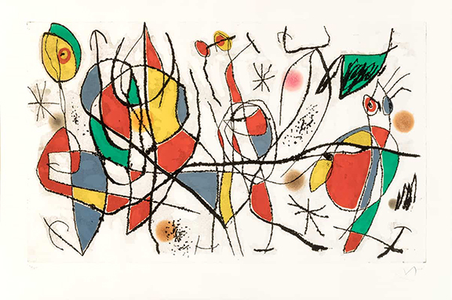
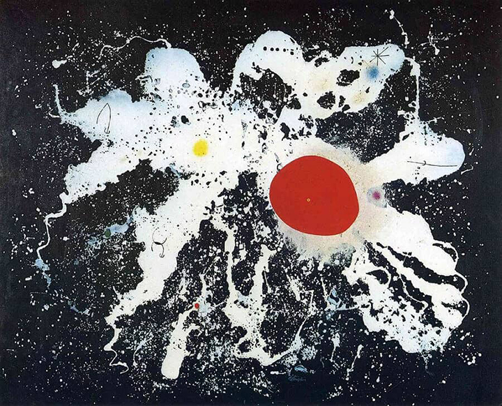
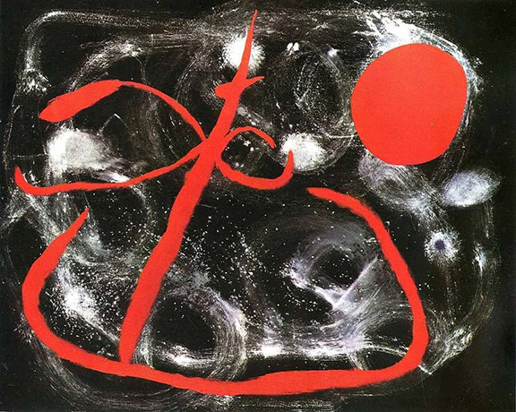
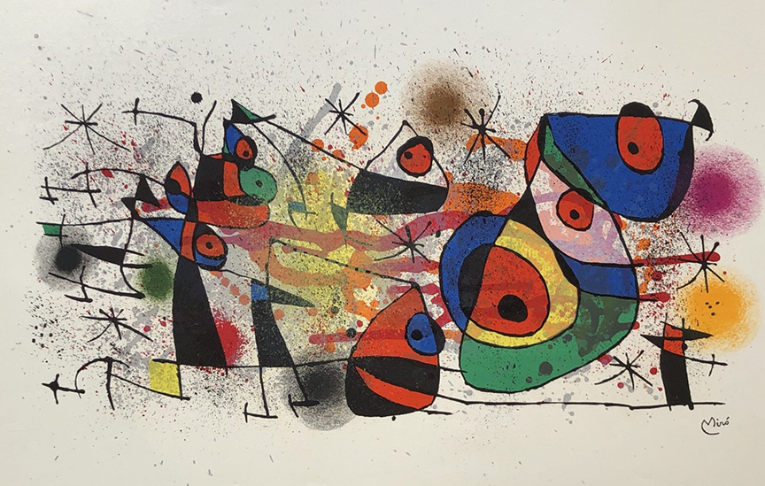

# [Joan Miró](https://www.joan-miro.net/)
Joan Miró (1893–1983) was a Catalan Spanish painter, sculptor. His work is often associated with Surrealism, although Miró himself distanced his style from any particular movement, embracing a highly individualistic approach that combined elements of abstraction, fantasy, and childlike imagination.

His work continues to be admired for its playfulness, its emotional depth, and its embrace of primitive symbolism, balancing between the spontaneous and the carefully constructed. Joan Miró's work is celebrated for its imaginative qualities, innovative use of color and form, and deep connection to the subconscious and childhood innocence. His influence is seen across multiple disciplines, particularly in abstract art, graphic design, and sculpture.

Joan Miró's artistic career cannot be confined to a single movement, as his work evolved over time and incorporated multiple influences. However, the most significant movements and styles he is associated with are:
#### Miró’s work, rich in symbolism, abstraction, and emotion
> Surrealism (especially in his earlier work)

> Abstract Art and Abstract Expressionism (especially in his later work)

> Catalan Modernism and Folk Art influences
### Surrealism and Abstract Expressionism
> Miró’s work was deeply influenced by Surrealism, particularly the works of André Breton and Max Ernst, though he also infused his art with his own distinctive approach. His work is known for its emphasis on subconscious expression, using forms and shapes that evoke mystery, dreamlike imagery, and emotional depth.
> His later work evolved into abstract expressionism, where color, form, and composition became even more important than any subject matter.
### Bold, Symbolic Imagery
> Miro’s works often feature playful, organic shapes and vibrant colors, incorporating symbolic imagery such as stars, moons, birds, and women. These symbols are highly abstracted and can be interpreted in numerous ways, offering an open-ended experience for the viewer.
> The childlike quality in his forms — often geometric shapes or primitive motifs — gave his paintings a spontaneous and unrefined feel, contributing to their emotional energy and dreamlike atmosphere.
### Connection to Catalonia
> Miró’s roots in Catalonia were deeply important to his artistic identity. ```The Catalan culture,```with its folklore, history, and architecture, influenced his work, and he often drew inspiration from its rich traditions.
> His landscapes and iconography reflect a connection to the Catalonian countryside, where he spent much of his childhood.



Joan Miró, L'Invitée du Dimanche I (Sunday Guest I), 1969
- The work features a blend of geometric shapes, fluid lines, and organic forms that seem to float on the canvas, giving the painting a dreamlike, ethereal quality.
- Figures or faces, typical of Miró’s art, These forms are simplified, organic shapes that play with the idea of representation without being fully literal.
- The title, "Sunday Guest," might allude to a figure or entity that is transient, present only in a fleeting moment, much like a guest on a Sunday afternoon—an image that brings together personal and universal themes of hospitality, mystery, and transient presence.
- Vivid and Contrasting Colors - The painting is characterized by bold, contrasting colors, with shades of blue, red, yellow, and black dominating the composition. These primary colors were significant in Miró's work, often evoking emotions and adding visual rhythm to the piece. ```The use of contrasting colors alongside softer tones adds depth and vibrancy,``` contributing to the playful yet serious nature of the painting.
- Composition and Space - ```Miró’s composition in this piece is dynamic, with shapes distributed across the canvas in a seemingly spontaneous manner.``` The open spaces between the forms allow the viewer’s eye to move freely, creating a sense of lightness and openness. Miró uses ```both positive and negative space``` effectively, balancing the weight of bold shapes with the expansiveness of the background.
- Link to Miró’s Late Work - By 1969, Miró was no longer concerned with representing figures or objects realistically, but rather with ```evoking an emotional and subconscious response through form, color, and gesture.``` His later works, including "L'Invitée du Dimanche I", often featured simplified shapes and abstracted symbolism that continue to explore the boundaries of the conscious and unconscious mind.
```The use of free-form lines and spontaneous brushstrokes reflects his embrace of the automatic techniques developed by surrealists, allowing his subconscious to guide the composition.```
- Personal and Cultural Context - Miró's later works were often more introspective, reflecting his personal experiences, the tumult of the 20th century, and his Catalan heritage. In the case of "L'Invitée du Dimanche I", there may be a subtle reference to the significance of rituals or gatherings, such as a Sunday guest, ```symbolizing fleeting moments in time and the interplay between solitude and presence.```
- Connection to the Surrealist Legacy - Miró’s work, particularly his late paintings, was influenced by the surrealist movement, though his style became even more focused on abstraction, leaving behind more representational or figurative content. Works like "L'Invitée du Dimanche I" reflect the surrealists' exploration of the subconscious, dreams, and free association, but Miró’s approach was uniquely his own, moving beyond surrealism’s initial ideas.
"L'Invitée du Dimanche I" exemplifies Miró’s commitment to exploring abstraction, spontaneity, and the subconscious mind. The painting is not just a visual experience but also a psychological and emotional one, inviting the viewer to interpret the forms and symbols in a highly personal way.



The Red Disk, 1960 by Joan Miro

Set against a dark blue, almost black surface, a white splotch of paint has been hurled out impulsively, and loses itself in innumerable spots and spatters, a cosmic gesture thrust against the empty void of nothingness - almost a metaphor of the artist's creative activity. Some spots of colour flare up among this galaxy of creativity, of which the largest and most irregular is the red one which gave the painting its title. Minute symbols are scattered around the edges of the entire constellation - stars of hair and little hooks which give this action painting a new poetic dimension and connect it unmistakably with Miro's world of symbols.
- Themes - The Cosmic and the Universal: The use of a central red disk evokes themes of the cosmos, universality, and the sun, a recurring symbol in Miró’s work. The simplicity of the red circle suggests an elemental force—something timeless, primal, and universal. Abstraction of Nature and Emotion: Like many of his later works, Miró explores the emotional impact of color and form, using abstraction to capture feelings rather than representational subjects.
- Bold Use of Color - The central feature of the painting is the large, vibrant red disk, which dominates the canvas. The red color is bold and saturated, drawing the viewer’s eye immediately. This choice of color is significant as red in Miró's works often symbolizes vitality, energy, and passion.
```The red disk contrasts sharply with the rest of the composition, which is more minimalistic and uses shades of black, blue, and yellow, creating a striking visual impact.```
- Simplicity and Abstraction - "The Red Disk" embodies Miró's later interest in abstraction and simplicity. ```It features minimalist shapes, with the red disk representing an almost primal form. Miró was no longer concerned with recognizable objects but instead focused on reducing his art to its essential elements.``` The background and surrounding forms—such as lines, dots, and curved shapes—serve to complement the central disk but don’t distract from it. The abstraction creates a sense of balance and harmony.
- Symbolism and Emotional Resonance - The disk itself could be interpreted in multiple ways, from a sun or moon, to a universal symbol of wholeness, unity, or energy. Miró’s work is open to personal interpretation, and the forms in "The Red Disk" evoke an emotional response that is not tied to any specific representational meaning. The simplicity of the work allows viewers to connect with the piece in a deeply emotional or subconscious way, emphasizing Miró’s belief in the power of pure form and color to communicate beyond language.
- Dynamic Composition - Miró's placement of the red disk, surrounded by fluid lines and shapes, creates a dynamic, almost cosmic feel. The composition has a sense of movement and rhythm, as if the shapes and forms are in flux or interaction with each other. ```This dynamic quality reflects Miró’s ongoing exploration of the relationship between chaos and order.``` The surrounding shapes and lines seem to float around the central red disk, ```creating a sense of space and openness``` that is typical of Miró’s later works.
- Connection to His Earlier Works - "The Red Disk" represents a continuation of Miró’s surrealist roots and his exploration of the unconscious mind. Like his earlier works, the piece involves symbolic abstraction, where the colors, shapes, and composition evoke emotion and thought rather than specific imagery.The painting’s simplicity reflects a mature phase of Miró's career where his focus was on expression through pure abstraction, allowing for a deeper, more intuitive connection with the viewer.
- Miró’s Use of Organic Forms - While "The Red Disk" is a highly abstract piece, there are still traces of organic shapes that ```reflect Miró’s fascination with nature.```The curved lines, along with the presence of circular and elliptical shapes, could suggest connections to biological forms, nature, or the cosmos, emphasizing Miró's continued engagement with the natural world in a highly abstract way.



Joy of a Little Girl in Front of the Sun, 1960 by Joan Miro

At the beginning of the 1960s artists took fresh pleasure in experimenting with the art of painting. This led to many exciting discoveries which often consisted entirely of broad movements and the spontaneously creative use of colour. In this painting Miro used a black surface on which he spread some white paint, making it appear thin and blue - like a spiral nebula in the vastness of space. Hovering above it is a large red figure with protruberances like pincers, encompassing in a broad gesture the entire space of the painting, or rather the "inner space of the world" (as Rilke put it), as if praying to cosmic forces.

"Joy of a Little Girl in Front of the Sun" (1960) is a vivid, energetic work that captures the spirit of childhood joy, innocence, and freedom. Through its use of color, form, and abstract symbolism, Miró creates an artwork that invites personal interpretation while reflecting universal themes of life, vitality, and spontaneous expression. It’s an excellent example of Miró’s later work, where abstraction and symbolic language come together to evoke deep emotional resonance.
- Abstraction and Symbolism - The work uses abstract shapes and bright colors to evoke a sense of playfulness and innocence. In this painting, ```the “little girl” might not be explicitly represented, but through soft forms, circular shapes, and simplified human figures, the painting evokes a sense of childhood joy.```
- The sun in the title is depicted through circular and radiating forms, symbolizing energy, warmth, and perhaps the radiance of childhood.
- Color and Energy - Bright, primary colors like yellow, red, and blue dominate the canvas, creating a sense of vitality and cheerfulness. The use of vibrant color helps convey the energy of the sun and the joyful, carefree spirit of a child.The sun is often a motif in Miró’s work, representing not just a celestial body, but a symbol of life, power, and universal energy. In this painting, the sun serves as a visual anchor that ties the composition together.
- Playful Composition - The composition feels free-flowing, almost as if it’s in motion, with the forms dancing around the central sun figure. The asymmetry and seemingly random arrangement of elements contribute to a sense of unpredictability, mirroring the spontaneity and unpredictability of childhood joy.



Joan Miró, Ceramiques, 1974

- Organic and Playful Composition - The forms in "Ceramiques" are often organic and fluid, not bound by rigid geometric constraints. They seem to echo natural forms like faces, birds, or animals, but are still abstracted and simplified. The irregularity of the pieces also conveys a sense of play and experimentation, allowing for multiple interpretations and emotional responses.
- The Human Figure - While the figures in these works are highly abstracted, Miró often referred to human forms, especially feminine figures or facial features. This theme is recurring in his work, reflecting his interest in the human experience and the psyche.