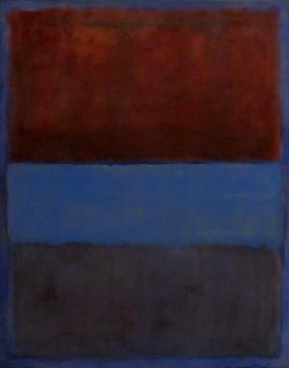
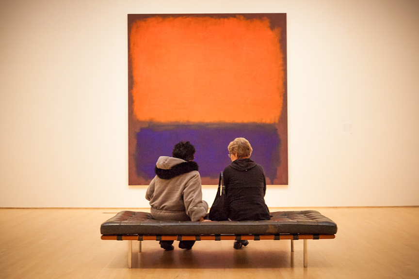
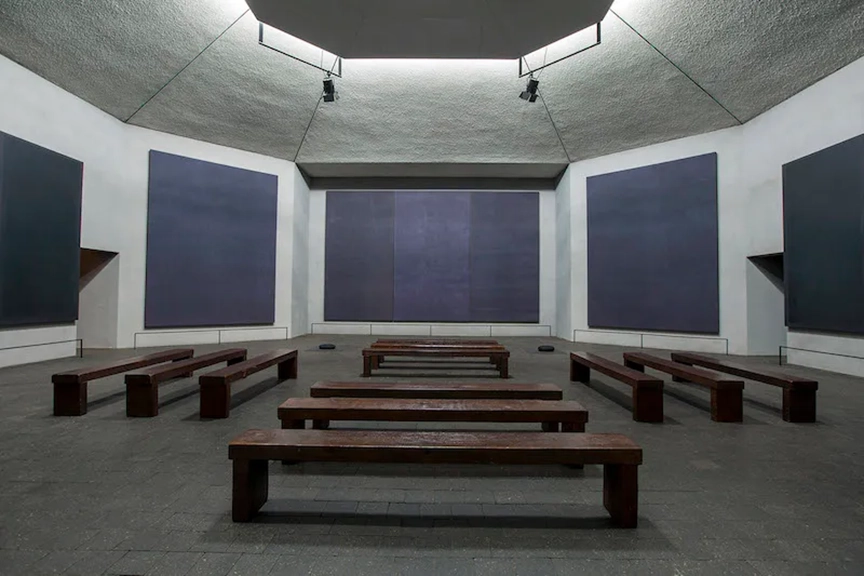

# [Mark Rothko](https://www.markrothko.org/)
## Core Ideas Behind Rothko's Art
#### Emotional Intensity
Rothko believed that painting could (and should) evoke deep emotions—like tragedy, ecstasy, and doom. He wanted you to feel something profound, almost sacred, in front of his work.

“I'm not an abstractionist... I’m interested only in expressing basic human emotions—tragedy, ecstasy, doom.” — Rothko

#### Non-Narrative, Non-Symbolic
Rothko rejected symbolism, stories, and even titles. He stopped naming his paintings and gave them numbers or colors instead.

He didn’t want you to "figure out" the painting—he wanted you to experience it.

#### Color as a Spiritual Force
His use of color wasn’t decorative—it was spiritual and psychological. The soft, glowing rectangles were meant to draw you in, to create a kind of meditative space.

The colors often seem to breathe, shimmer, or pulse—especially in person.

#### Large Scale = Immersion
Rothko made his paintings huge, often taller than the viewer. He said he wanted people to stand close, so the color fields would engulf their peripheral vision—like being inside a quiet storm of feeling.

No. 61 (Rust and Blue), 1953
Mark Rothko’s No. 61 (Rust and Blue), 1953 is a profound example of how abstract color fields can carry intense emotional and spiritual weight—even without any recognizable image or narrative.
####  Visual Description
Color blocks:

A glowing blue field dominates the upper section

Deep, warm rust-red in the lower section

A dark, almost blackish band lies in between—creating tension and transition

Edges: The borders of each block are soft, bleeding into each other. They’re not hard-edged or mechanical; they feel alive, pulsing.

Background: A warm, earthy tone that anchors the canvas and intensifies the color relationships.

####  Emotional and Physical Impact
Standing in front of it, you don’t just see the painting—you feel it. Rothko wanted the viewer to:

#### Be immersed in the color

Feel stillness, melancholy, or even awe

Experience it like a silent dialogue or meditation

The deep blue suggests infinite depth or introspection, while the rust color has a grounded, human, even mournful presence.

#### Spiritual and Philosophical Meaning
While Rothko didn’t assign explicit meaning, viewers often interpret this work through:

Duality: heaven and earth, spirit and body, light and shadow

Silence: there’s no action, no symbols—just pure presence

Threshold: that dark band might be a passage, a veil, or a horizon

Rothko often said he was painting “tragic and timeless themes.”

### No Narrative—Only Experience
Rothko deliberately removed titles, stories, and symbols to avoid telling you what to feel. He wanted the painting to be a mirror for your inner life.

He believed that art could function like a religious experience—not preaching, but inviting the viewer to go inward.

No. 14, 1960

The Rothko Chapel (Houston, 1971) — A sacred, meditative space filled with large dark purple and black paintings.

### Can pure color and minimal form truly resonate with everyone?
- Emotion through atmosphere: Many people report crying in front of Rothko’s paintings—not because they understand them, but because they feel something profound.
- Universality: Without symbols or stories, his works speak in a kind of emotional language beyond culture and language.
- Space for projection: Viewers can bring their own memories, moods, and silence into the experience.

“A painting is not about an experience. It is the experience.” — Rothko
#### But... Not Always
Some people feel disconnected or frustrated by minimalism. They might say:

“It looks simple.”

“Why is this considered art?”

“I don’t get it.”

Without context or emotional openness, the work may feel empty or inaccessible.

It often takes time, stillness, and presence—something that modern viewers may not always have.
#### Art that doesn’t “say” anything directly asks the viewer to slow down, to feel, to be. Not everyone resonates with that at the same time or in the same way—and that’s part of its beauty. Like meditation or poetry, it may not strike you on the first try. Or it may strike someone unexpectedly, in a quiet moment