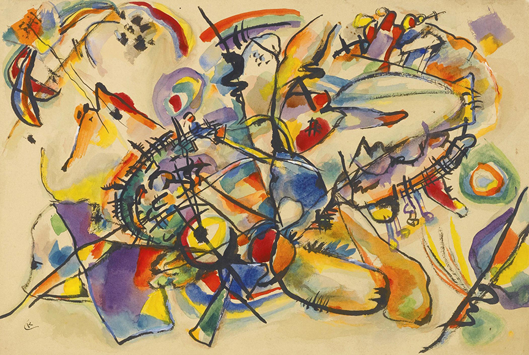

# [Wassily Kandinsky](https://www.wassilykandinsky.net/)
## Principles of abstract art 
Abstract art requires artists to break free from traditional figurative expressions and break through the constraints of reality to convey emotions, ideas and concepts in a freer and more innovative way. 

Abstract art does not rely on images in the real world, but expresses emotions and ideas through elements such as shape, color, line and texture.
### Visualize complex information and express it in an easy-to-understand way
### Invisible things become perceptible graphics and interactive elements
- Real-world objects, concepts or emotions are transformed into non-figurative, visual forms

  That is, invisible things become perceptible graphics
    - Shape/color/time & motion/data & information visualization
- Abstraction is the generalization, simplification and transformation of reality
    - Removing specific forms: images are transformed into geometric lines and color blocks
    - Symbolization: symbols or shapes replace specific things in reality
    - Emotions and energy: colors, shapes, dynamic lines express inner emotions
    - Visual metaphor: visual images are used to metaphorically represent invisible concepts
- Balance between concrete and abstract
    - Simplified form - Concrete forms are gradually simplified into geometric shapes or curves, retaining key visual features
    - Structure and deconstruction - Real objects are processed geometrically or fragmented, retaining a certain structural logic,making them recognizable and artistically processed
    - Color and emotion - The form tends to be abstract, using familiar colors or light and dark contrasts,allowing the audience to establish a connection with the real world in the subconscious
    - Partial concrete & overall abstract - The overall tendency is abstract, and the local concrete elements provide clues for interpretation
    - Movement & dynamic change - In interaction or animation, dynamic gradient,let the concrete elements gradually transform into abstract forms
- ### Simplification
Abstract art often reduces forms to their essence. It removes details and focuses on the basic shapes, colors, or lines that represent a subject—or sometimes, no subject at all.

Think: distilling a landscape down to blocks of color or shapes.

- ### Expression of Emotion or Thought
Rather than trying to imitate the real world, abstract art conveys feelings, moods, or ideas. The artist’s internal world is more important than external accuracy.

Example: Color and brushstrokes might express joy, chaos, or sadness.

- ### Focus on Elements of Art
Abstract artists often explore the pure elements of visual language:

Line

Shape

Color

Texture

Space

Form

They become the subject themselves—not a tool to represent something else.

- ### Non-Representational Forms
Abstract art often avoids recognizable objects. Sometimes it’s partly representational (like Joan Mitchell or Kandinsky), but it’s never about realism.

The work might suggest nature, people, or architecture, but never directly show them.

- ### Composition and Balance
Even in chaotic or expressive styles, there’s an underlying concern with visual balance, movement, and harmony—just like in design.

Abstract artists consider how elements interact in space, guiding the viewer’s eye.

- ### Freedom and Intuition
There’s often a strong sense of personal freedom, intuition, and spontaneity in abstract art. Artists break rules intentionally or invent their own systems.

Many abstract works evolve during the making process, rather than being fully planned.

- ### Philosophical or Conceptual Depth
Some abstract artists are influenced by spirituality, philosophy, psychology, or even math and science. They use abstraction to go beyond the surface of things.

Example: Kandinsky believed colors and shapes could create a kind of visual music that touches the soul.


Improvisation. Deluge 1913 Oil on canvas 37.4 × 59.1" 

```"Deluge" refers to a great flood or overwhelming force```—so you can imagine this work not as a literal flood, but as an emotional or spiritual storm. Kandinsky isn’t showing water or people drowning; 
```he’s expressing chaos, energy, destruction, and transformation.```

## Key Principles in This Work
### 1. Improvisation (Spontaneity & Emotion)
Kandinsky used the term "Improvisation" to describe works that ```came from his intuition rather than pre-planned sketches.``` These paintings are full of emotional charge, painted quickly and expressively—like a kind of visual jazz.
### 2. Spiritual Meaning
Kandinsky believed art could awaken spiritual consciousness. The deluge might symbolize a spiritual cleansing—tearing down the old world to make space for something new.
### 3. Color as Sound
He felt that colors and shapes were like music—each had a vibration and could touch the soul. In this painting:

Reds and oranges = urgency, heat, danger

Cool blues and purples = deeper emotions, sorrow, calm amidst chaos
### 4. Dynamic Composition
```There's no central subject.``` Your eye keeps moving—left to right, top to bottom—like you’re swept up in a current. That’s intentional: the painting feels like motion, like the flood is coming at you.
### 5. Abstraction + Suggestion
```You might spot hints of figures, buildings, even a boat—but they’re broken up, distorted, almost unrecognizable. Kandinsky gives just enough suggestion to stir the imagination but avoids clear storytelling.```
### 6. Emotional Impact over Realism
This work doesn’t explain—it makes you feel. Viewers might experience:

Panic

Awe

Mystery

Revelation

```That’s what abstract art aims for: to bypass the intellect and go straight to the emotional core.```



Title: Untitled (c.1916)
Artist: Wassily Kandinsky
Medium: Likely watercolor, gouache, and pencil on paper (common for his sketches during this time)
Style: Abstract / Geometric abstraction
Period: Transitional—between early improvisations and his later Bauhaus style

The refined balance between the colour and form in the Untitled holds the visual power of his Munich period (for example, refer to Composinion No. 7) but also comprises some new liveliness and a sense of compositional unity. It is a whirlpool of colour that underlies it, bursting with its sparkling yellow and blue and accentuated with thin black lines. Paul Overoy wrote: “Those several works he created show an unceasing evolution, some progressive reconsidering in colour. In the works painted in Russia geometrical shapes arise from gradual simplification of the amorphous shapes typical of Munich period paintings [...]. Painting elements seem to be in a state of tension; on the one hand, they show a way to geometricity, and on the other – that to spontaneous bursting forms of his Munich works.”
## Visual Characteristics
- Color palette: Earthy reds, soft blues, muted yellows—more subdued than his earlier bright explosions.
- Form: Geometric shapes (circles, lines, triangles, arrows), scattered or carefully balanced across the page.
- Space: A sense of controlled visual architecture—not chaotic, but more like a planned composition.
- Texture & Material: The medium is softer, more intimate—maybe even meditative.

## Interpretation & Principles
- ### Spiritual Geometry
By 1916, Kandinsky believed deeply in the spiritual value of geometry. Circles, triangles, and lines weren’t just design elements—they were symbols of universal truths.

Circle = eternity, the cosmos

Triangle = growth, aspiration

Line = direction, motion, life force

- ### Inner Sound
Kandinsky often talked about “inner necessity”—the inner voice that guided the artist’s decisions. In this untitled work, every line and color seems intentional, like a visual language you can’t “read” but somehow feel.
- ### Balance & Composition
Unlike his explosive improvisations, this work reflects calm, equilibrium, and maybe even a search for order during wartime chaos (WWI had broken out, and Russia was in upheaval).
- ### Sketch as Philosophy
Even though it’s titled Untitled, this piece feels like a visual meditation. It may have been part of his process of thinking—an exercise in expressing internal harmony.

Kandinsky saw his abstract work as "visual poetry," where color and form work like rhythm and metaphor.

- ### Pre-Bauhaus Language
This piece predicts his Bauhaus period (starting in 1922), where his art would become even more geometric, structured, and design-focused. It's a transition from emotionally driven improvisation to conceptual, formal abstraction.

✨ In Summary
"Untitled (1916)" is:
- A bridge between emotional and conceptual abstraction
- A quiet, refined study of spiritual symbols and balance
- Less about chaos, more about inner calm, searching, and structure

